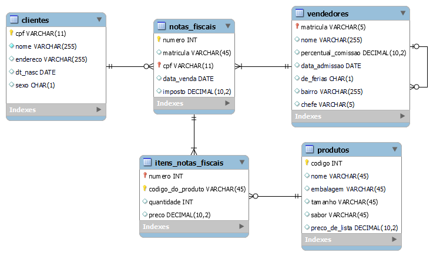

## SQL Chapisco

Simples repositório para armazenar problemas de SQL e suas respectivas soluções com foco na preparação para a discursiva de TI da SEFAZ-MG.

Os códigos SQL podem ser testados na ferramenta [SQL Fiddle](https://sqlfiddle.com).
> Todos os códigos foram testados utilizando o Oracle 11g

Todos os problemas são baseados no modelo abaixo:

Esse modelo foi construído no MySQL Workbench 8.0, o arquivo para alteração está na pasta modelo deste repositório.

Thats all folks!

---
Pierry A. Pereira